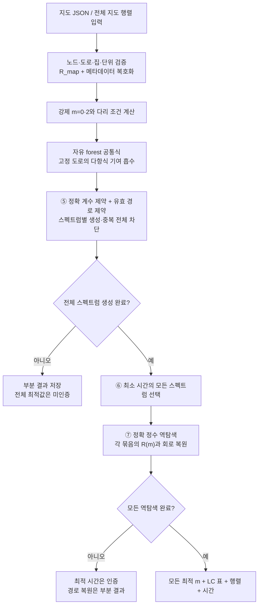

# 전체 알고리즘 흐름

현재 선택: **기존 정확 생성기 + 안전한 조건 축약 + 고정 도로 다항식 흡수**. BDD, 블록 분해, 기존 경로 DP는 이 통합 실행의 단계가 아니다.

## 1. 입력과 행렬
기본 지도에는 실제 도로와 양의 정수 이동 시간, 집 표시, 비음 정수 지연, 출발점, 단위가 들어간다. 이를 기준 횟수 1의 전체 지도 행렬 R_map과 메타데이터로 표현한다. 모든 도로의 횟수 1을 유효 경로로 가정하지 않는다.

## 2. 경로 행렬족
경로는 방문 순서 대신 도로 이용 횟수 m으로 구분한다. `R(m)=H[I+B diag(gm)Bᵀ]`가 각 경로의 정확 계산 행렬이다. ⑤는 후보마다 이 행렬을 모두 만들어 고유분해하지 않고 **이 행렬족의 공통 특성다항식**을 만든다.

## 3. 안전한 조건 축약
가게와 필수 집을 분리하는 다리는 m=2, 가게와 분리된 비필수 성분은 m=0이다. 고정된 도로의 기여를 공통식에 흡수한다. 선택적 우회로는 전체 스펙트럼 보존을 위해 임의로 제거하지 않는다.

## 4. ⑤ 스펙트럼 생성
정확 특성다항식 계수와 경로 유효 조건을 Z3 정수 제약으로 결합한다. 새 계수 벡터 하나를 출력한 뒤 그와 같은 스펙트럼의 모든 후보를 제외한다. 코스펙트럴 묶음은 이 단계에서 중복 출력되지 않는다. 내부에는 존재 증인인 m과 탐색 비용이 남아 있다.

## 5. ⑥ 시간 비교
`P(t)=t^n+c_1t^(n−1)+...+c_n`이면 `T=t★(−c_1−n)`이다. 같은 최소 시간에 다른 스펙트럼이 여러 개면 모두 선택한다. 같은 스펙트럼이면 같은 시간이나 그 역은 일반적으로 성립하지 않는다.

## 6. ⑦ 스펙트럼 역탐색
선택한 스펙트럼과 원래 지도를 함께 사용한다. 정확 정수 가지치기와 최종 charpoly 비교로 가능한 모든 m을 찾는다. R(m)에서 LC 표와 물리 행렬을 복원하고 왕복 변환을 검증한다. 교대 투사는 통합 실행에서 꺼져 있다.

## 7. 완료와 출력
⑤의 전체 생성과 모든 목표에 대한 ⑦ 역복원이 완료되어야 전체 complete=true다. 최종 결과에는 모든 최적 m, 소요 시간, 정확 행렬, LC 소자 표가 들어간다. 방문 순서 열거와 실물 회로 측정은 현재 완료 범위 밖이다.

## 8. 구현 완료의 정확한 의미
현재 명세의 실행 흐름과 작은 입력의 정확성 검증은 완료되어 있다. 원본 프로젝트 자동 검증은 총 83개를 통과했다. 임의 대규모 지도에서의 성능 우위, 고전 알고리즘 대비 시간복잡도 개선, 실물 LC 실험은 아직 완료한 결과가 아니다. 이번 정리에는 새로운 성능 비교 시뮬레이션을 추가하지 않는다.

## 단계와 코드 대응
| 단계 | 정리본 위치 |
|---|---|
| 입력·지도 행렬 | 02_세부알고리즘/01, 02 |
| LC 배정·회로 표 | 02_세부알고리즘/03 |
| 조건 축약·공통 다항식·제약 | 02_세부알고리즘/04, 05, 06, 07 |
| ⑤·⑥ | 02_세부알고리즘/08 |
| 목표 스펙트럼·⑦·복원 | 02_세부알고리즘/09, 10, 11 |
| 통합 실행 | 02_세부알고리즘/12 |
