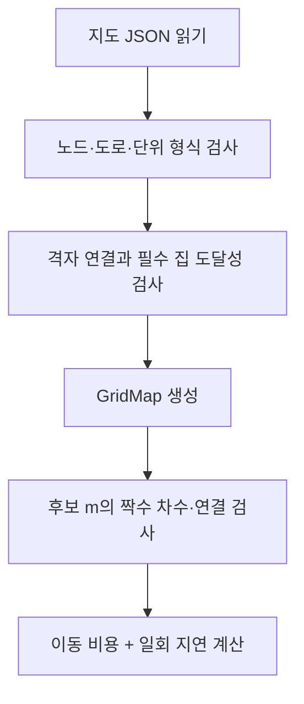

# 입력 검증과 공통 경로 조건

## 입력과 출력
입력은 `lc-grid-v1` 지도 JSON이다. 출력은 불변 자료형 `GridMap`이며 이후 모든 모듈이 공유한다. `candidate_errors(m)`는 주어진 횟수의 유효성을 검사할 뿐 후보들을 생성하지 않는다.
## 요소별 작동
- `Node`: 정수 좌표 x,y, 집 여부 house, 비음 정수 배달 지연 delay.
- `Edge`: 서로 다른 두 노드 u<v와 양의 정수 이동 시간 time.
- 외부 노드 번호는 1부터, 내부 인덱스는 0부터다. 가게는 외부 1번이다.
- 가게 이후 노드는 (y,x) 순서, 도로는 (u,v) 순서로 중복 없이 저장한다. 대각선과 한 칸을 넘는 도로는 금지한다.
- 방문할 집에 도달할 수 없는 지도는 입력에서 거부한다. 비필수 분리 성분은 허용하되 경로에서 사용하지 못한다.
- 유효 경로는 모든 집을 방문하고, 모든 사용 도로가 가게에 연결되고, 각 통행 차수가 짝수다. Euler 귀환 보행이 존재한다는 조건이며 방문 순서를 출력하지 않는다.
## 사용하는 행렬·벡터
- `m=(m_0,...,m_(p−1))`: 도로별 이용 횟수. 이 공통 검사 자체는 비음 정수만 요구하고, ⑤에서 0·1·2 상한을 추가한다.
- `degree_i=Σ incident m_e`, `time_ticks=Σ_e w_e m_e + Σ_i δ_i`.
- 좌표·집·도로 정보를 표로 저장하며 여기서는 고윳값을 구하지 않는다.
## 보조 기능
`diamond_chain`, `random_grid`는 예제 지도 생성 보조 함수다. 전자는 이름에 chain이 있어도 운영 알고리즘의 블록 풀이가 아니다. `load_map`, `write_json`은 입출력 함수다.

## 복사 코드와 함수 목록

[원본 그대로의 map_data.py](map_data.py)

`ValidationError`, `ResourceLimit`, `integer`, `positive_fraction`, `Node`, `Edge`, `GridMap`, `load_map`, `write_json`, `diamond_chain`, `random_grid`

표시된 함수 중 예제 생성·교대 투사·수치 행렬은 위 설명의 호출 범위에 따라 보조 기능일 수 있다.
