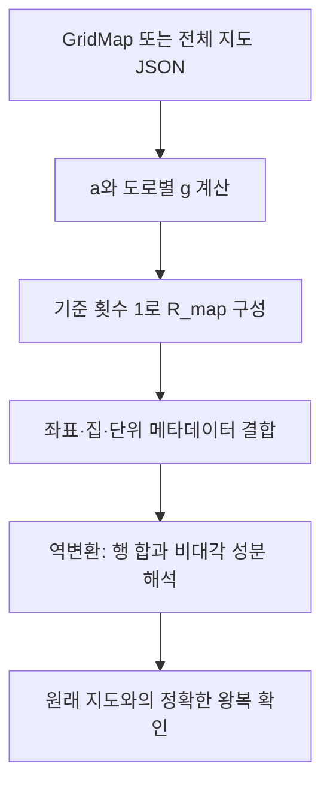

# 전체 지도 행렬 생성과 복호화

## 입력과 출력
`encode_whole_map(grid)`는 `lc-whole-map-v1`을 만든다. `decode_whole_map(data)`는 이를 다시 `GridMap`으로 복원한다. ⑤는 복호화한 지도를 사용한다.
## 사용하는 행렬
`a_i=1+δ_i`, `H=diag(a_i)`, `g_e=w_e/(a_u+a_v)`.
`R_map=H[I+B diag(g_e) Bᵀ]`, 크기는 n×n이다. 모든 도로 기준값 1은 도로 존재 표시이며 유효 귀환 경로라는 뜻이 아니다.
## 요소별 검사
- 행 합 `Σ_j R_map[i,j]=a_i`에서 δ_i=a_i−1을 복원한다.
- `g_uv=−R_map[u,v]/a_u=−R_map[v,u]/a_v≥0`이어야 한다.
- 양수 g에 대해 `w_uv=g_uv(a_u+a_v)`가 양의 정수여야 한다.
- 좌표, 집 표시, 가게, 양의 단위를 검사하고 행렬을 다시 만들어 정확히 일치시킨다.
## 주의
지연이 0인 집도 필수 방문 대상이므로 house 메타데이터를 없앨 수 없다. 고윳값은 이 입력 행렬 하나를 고유분해해서 얻는 것이 아니다. ⑤가 경로 행렬족의 공통식을 따로 구성한다.

## 복사 코드와 함수 목록

[원본 그대로의 whole_map_matrix.py](whole_map_matrix.py)

`encode_whole_map`, `decode_whole_map`

표시된 함수 중 예제 생성·교대 투사·수치 행렬은 위 설명의 호출 범위에 따라 보조 기능일 수 있다.
