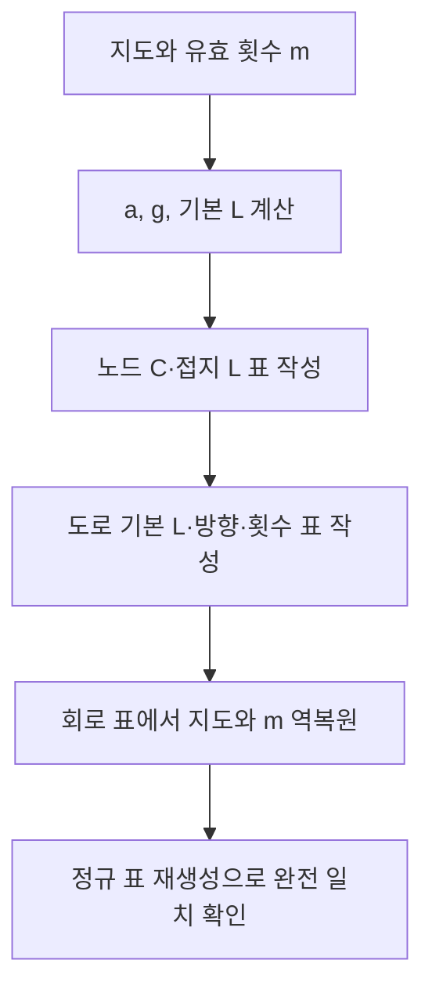

# LC 소자 배정과 회로 표의 왕복 변환

## 입력과 출력
`LCModel(grid)`는 LC 배정 규칙을 보관한다. `encode(m)`은 노드 소자 표와 도로 소자 표를 만들고 `decode_circuit`은 지도와 m을 복원한다.
## 주요 행렬과 물리량
- 노드: `C_i=C★/a_i`, 모든 노드에 접지 인덕터 `L★`.
- 도로 기본 인덕턴스 `ell_e=L★/g_e`, 활성 유효 인덕턴스 `L_eff=ell_e/m_e`.
- m_e=0이면 해당 도로는 개방이다. 원래 도로의 기본 L과 라벨은 표에 계속 남긴다.
- `Kbar=I+B diag(gm) Bᵀ`, `R=H Kbar`, `D=H^(1/2) Kbar H^(1/2)`.
- `matrices(m)`는 Kbar와 유리수 R, 수치 대칭 D를 반환하는 보조 기능이다. 운영 ⑤는 이 함수를 후보마다 호출하지 않는다.
## 요소별 설명
노드 표는 n×8, 도로 표는 p×7이다. 소자 종류 코드는 L=1, C=2이며 방향 코드는 오른쪽=1, y 증가 방향=2, 왼쪽=3, y 감소 방향=4이다. 접지는 0, 가게는 1이다.
`decode_circuit`은 C로 지연, 기본 L로 도로 비용을 복원한 다음 방향·연결·유효 횟수·정규 표를 검사한다. 단순히 소자 종류 열만 삭제하면 지도 비용이 나오는 것은 아니고 역변환 식을 사용한다.

## 복사 코드와 함수 목록

[원본 그대로의 lc_model.py](lc_model.py)

`LCModel`, `decode_circuit`

표시된 함수 중 예제 생성·교대 투사·수치 행렬은 위 설명의 호출 범위에 따라 보조 기능일 수 있다.
