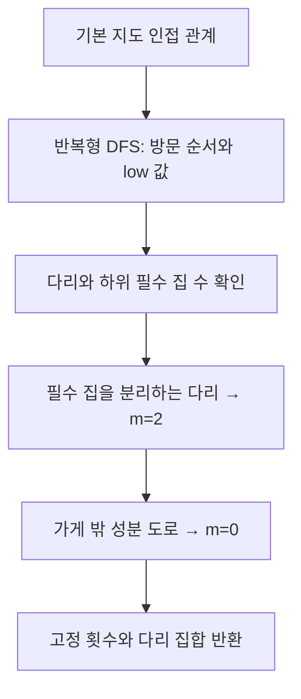

# 강제 이용 횟수와 다리 조건 계산

## 입력과 출력
입력 GridMap, 출력 `RouteReduction(fixed, bridges)`. fixed는 도로 인덱스→0 또는 2이고 bridges는 기본 그래프의 다리 집합이다.
## 핵심 원리
귀환 경로의 모든 꼭짓점 차수가 짝수이면 임의 절단을 지나는 통행 합도 짝수다. 절단을 혼자 지나는 다리는 0 또는 2회만 가능하다. 가게에서 필수 집에 가기 위해 반드시 건너야 하면 2로 고정한다.
## 요소별 설명
- 반복형 DFS로 discovery, low, parent_edge, component를 계산한다.
- 하위 트리에 필수 집이 있는 다리는 반드시 왕복한다.
- 가게에 연결되지 않은 비필수 성분의 도로는 0으로 고정한다.
- 가게에 연결된 선택적 막다른 길은 남긴다. 비최적 스펙트럼도 전체 생성 대상이기 때문이다.
## 사용하는 벡터와 비용
고정된 m 성분과 간선 인덱스 집합만 만든다. 지도 행렬의 행·열이나 미사용 노드의 모드를 삭제하지 않는다. O(n+p)의 그래프 연산이며 다항식/SMT 계산 시간과는 별개다. 재귀 대신 스택을 사용하고 협력적 기한 검사를 한다.

## 복사 코드와 함수 목록

[원본 그대로의 route_reduction.py](route_reduction.py)

`RouteReduction`, `reduce_route_domain`

표시된 함수 중 예제 생성·교대 투사·수치 행렬은 위 설명의 호출 범위에 따라 보조 기능일 수 있다.
