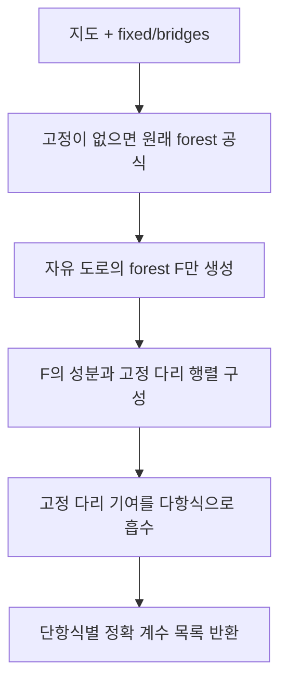

# 고정 도로를 흡수한 공통 특성다항식

## 목적과 출력
모든 경로 행렬에 공통인 `P(t;m)=det(tI−R(m))`을 한 번 구성한다. 반환값은 `{자유 forest의 도로 인덱스 튜플: t의 내림차순 계수 튜플}`이다. forest는 대수적 단항식이며 유효 경로 후보가 아니다.
## 주요 행렬과 식
F의 성분 C마다 `d_C(t)=t Σ_(i∈C)1/a_i−|C|`를 둔다. 고정 2 도로의 가중치 2g를 성분 사이에 옮긴 라플라시안을 L_fixed^F라 한다.
`q_F(t)=(-1)^|F| (∏_i a_i)(∏_(e∈F)g_e) det(diag(d_C(t))−L_fixed^F)`.
`P(t;m)=Σ_F q_F(t)∏_(e∈F)m_e`.
고정 도로는 원래 다리이므로 성분 사이에서도 forest이고, 그 모든 부분집합을 펼치지 않고 행렬식을 계산할 수 있다.
## 다항식 행렬식 계산
정점 v의 하위 행렬식을 F_v, v를 삭제한 행렬식을 G_v라 하자.
`G_v=∏_u F_u`.
`F_v=D_v G_v − Σ_u w_vu² G_u ∏_(z≠u)F_z`.
자식들의 접두·접미 곱을 공유하며 유리수 다항식 덧셈·곱셈만 쓴다. 이 내부 F_v 기호는 자유 도로 집합 F와 다른 기호다. 경로 최적화 DP가 아니라 트리 행렬식의 항등식이다.
## 범위와 한도
고정 다리가 b개면 해당 부분집합의 2^b배 전개를 흡수한다. 실제 시간의 2^b배 개선 보장은 아니다. 자유 forest 수는 여전히 지수적으로 커질 수 있다. 항 수/시간 한도를 넘으면 공통식을 불완전하게 사용하지 않고 중단한다. n차원과 접지 모드를 보존한다.

## 복사 코드와 함수 목록

[원본 그대로의 forest_coefficients.py](forest_coefficients.py)

`forest_basis`, `_mul`, `_fixed_tree_determinant`, `reduced_forest_basis`

표시된 함수 중 예제 생성·교대 투사·수치 행렬은 위 설명의 호출 범위에 따라 보조 기능일 수 있다.
