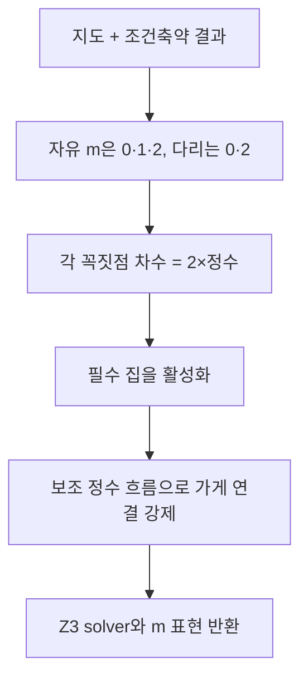

# 실제 귀환 배달 경로의 공동 제약

## 목적
특성다항식에 나타나는 m이 실제 배달 귀환 경로를 뜻하도록 제한한다. 경로를 먼저 나열하는 함수가 아니다.
## 주요 벡터·조건
- 자유 m_e는 정수이고 0≤m_e≤2. 고정값은 정수 상수다.
- 각 i에서 `Σ_(e incident i)m_e=2h_i`, h_i는 범위가 있는 정수.
- 가게는 항상 활성. 나머지는 인접 m 중 하나 이상이 양수일 때 활성이다. 모든 집은 활성이어야 한다.
- 방향을 임의로 붙인 도로마다 보조 흐름 f_e를 둔다. `−(n−1)≤f_e≤n−1`, m_e=0이면 f_e=0.
- 가게 외 활성 정점의 유입−유출은 1, 비활성 정점은 0. 가게는 나머지 활성 정점 수만큼 공급한다.
## 행렬 해석과 주의
흐름 식은 접속행렬을 이용한 정수 보존식으로 해석할 수 있지만 코드는 희소 목록으로 구성한다. f_e는 **연결성 증명용 보조 변수**이며 실제 LC 전류, 방문 순서, 도로 이용 횟수가 아니다. 동일한 m에 여러 흐름 증인이 있어도 스펙트럼 단위 차단을 사용하므로 출력이 중복되지 않는다.

## 복사 코드와 함수 목록

[원본 그대로의 route_constraints.py](route_constraints.py)

`build_route_constraints`

표시된 함수 중 예제 생성·교대 투사·수치 행렬은 위 설명의 호출 범위에 따라 보조 기능일 수 있다.
