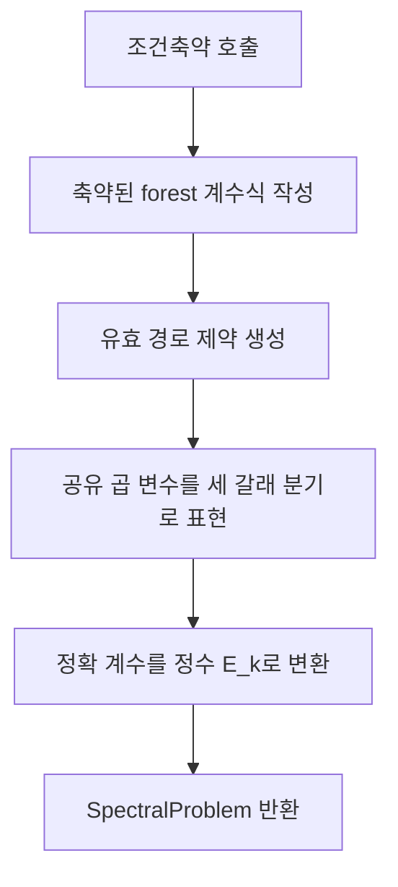

# 공통식과 경로 조건을 하나의 정수 문제로 조립

## 입력과 출력
입력 GridMap. 출력 `SpectralProblem(solver, counts, outputs, denominators, statistics)`.
## 주요 벡터
특성다항식 `P(t)=t^n+c_1 t^(n−1)+...+c_n`의 계수를 출력한다. k별 공통 분모 d_k를 골라 `E_k=d_k(−1)^k c_k`를 정수 변수로 둔다. E는 고윳값 벡터가 아니라 **스펙트럼을 정확하게 식별하는 계수 벡터**다.
## 요소별 작동
- 단항식 q_F=∏m_e의 접두 곱을 공유한다.
- m_e∈{0,1,2}이므로 새 곱은 `m=0 → 0`, `m=1 → 이전값`, `m=2 → 2×이전값`으로 표현한다.
- 변수끼리의 일반 곱 대신 If 분기와 선형 정수식으로 Z3의 QF_LIA 문제를 만든다.
- 각 E_k에 정확한 등식과 안전한 상·하한을 둔다.
- 고정값, 자유 변수 수, 남은 forest 항 수 등을 통계에 기록한다.
## 한계
식이 유한하고 정확하다는 사실은 해 찾기가 다항시간이라는 뜻이 아니다. 계수 분모는 다른 지도나 축약 전후에 달라질 수 있으므로 외부 비교에는 복원한 c 벡터를 사용한다.

## 복사 코드와 함수 목록

[원본 그대로의 spectral_constraints.py](spectral_constraints.py)

`SpectralProblem`, `build_spectral_problem`

표시된 함수 중 예제 생성·교대 투사·수치 행렬은 위 설명의 호출 범위에 따라 보조 기능일 수 있다.
