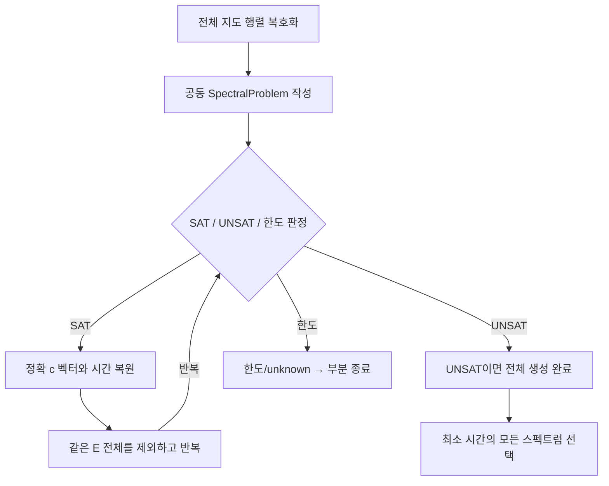

# ⑤ 스펙트럼 직접 생성과 ⑥ 최소 시간 선택

## 입력과 출력
입력은 전체 지도 JSON이다. 결과 `lc-generated-spectra-v1`에는 정확 스펙트럼 목록, 종류별 존재 증인 m, 시간, 완료 여부, 최소 시간 묶음의 인덱스가 들어간다.
## 실제 반복
SAT이면 E를 읽어 c_k=(−1)^k E_k/d_k로 복원한다. 경로 증인은 유효성과 시간을 검사하지만 그 증인의 고유분해로 스펙트럼을 만들지 않는다.
출력 뒤 `E_1≠이전값 OR ... OR E_n≠이전값`을 추가한다. 이전과 **같은 전체 스펙트럼**을 만드는 모든 m이 한꺼번에 제외된다. 내부 SAT/SMT 탐색에는 m이 남는다.
## 사용하는 식
`Σμ_j=−c_1`, `time_ticks=−c_1−n`, `time_seconds=t★(−c_1−n)`.
같은 시간인데 다른 c 벡터인 묶음은 모두 유지한다. 전체 생성이 완료되면 최소 시간과 같은 모든 묶음을 선택한다.
## 종료 분기
- UNSAT: 남은 스펙트럼이 없으므로 complete=true.
- timeout / unknown / forest 한도 / 출력 한도: partial. 관측 최소값을 전체 최적값으로 인증하지 않는다.
- --roots: 종류별 근삿값만 추가한다. 정확 동치 판정에는 사용하지 않는다.
기본 한도는 forest 10000, 스펙트럼 1000, 판정 10초, ⑤ 전체 협력적 60초다. ⑦ 전체 시간 제한과는 다르다.

## 복사 코드와 함수 목록

[원본 그대로의 direct_spectra.py](direct_spectra.py)

`generate_spectra`

표시된 함수 중 예제 생성·교대 투사·수치 행렬은 위 설명의 호출 범위에 따라 보조 기능일 수 있다.
