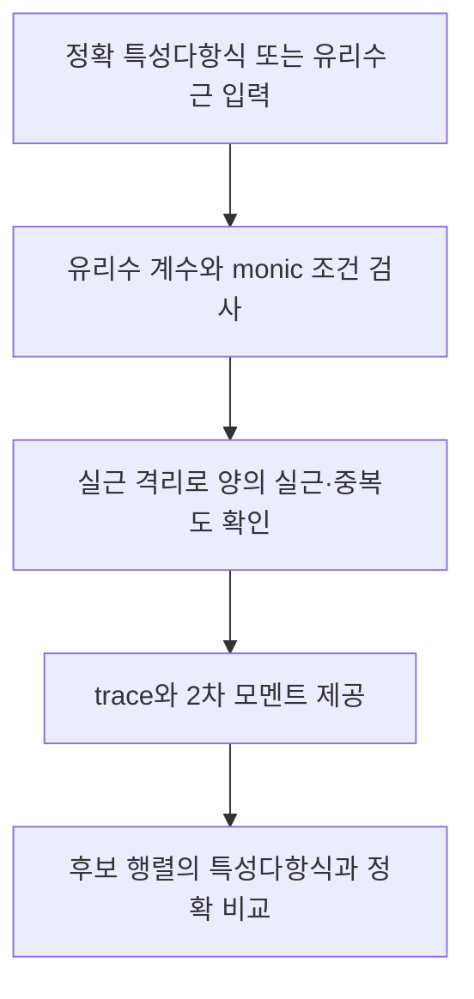

# 정확 목표 스펙트럼과 모멘트 검사

## 역할
⑦이 목표 스펙트럼을 정확하게 읽고 비교하도록 하는 자료형이다. 부동소수점 근의 근접 여부로 코스펙트럴을 판정하지 않는다.
## 사용하는 벡터와 행렬
- 계수 `(1,c_1,...,c_n)`는 t의 내림차순이며 중복근의 중복도까지 표현한다.
- `trace=−c_1`, `trace_square=c_1²−2c_2` (n=1이면 c_2=0).
- `matches(R)`는 R의 정확 charpoly 계수가 모두 같은지 검사한다.
## 입력 규칙
정수, Fraction, 정확 분수/소수 문자열을 허용한다. Python float나 임의 계산식을 문자열로 받아 실행하지 않는다. 현재 접지 LC 모델에서는 모든 μ가 양의 실수여야 한다. 개별 근이 무리수이면 정확 유리수 특성다항식을 사용하는 것이 기본이다.
## 수치 근의 용도
`approximate_values()`는 표시나 선택적 교대 투사의 안내에만 쓰인다. 운영 통합 실행의 정수 역탐색에서는 근삿값으로 가지를 제거하지 않는다.

## 복사 코드와 함수 목록

[원본 그대로의 spectral_target.py](spectral_target.py)

`exact_fraction`, `SpectralTarget`

표시된 함수 중 예제 생성·교대 투사·수치 행렬은 위 설명의 호출 범위에 따라 보조 기능일 수 있다.
