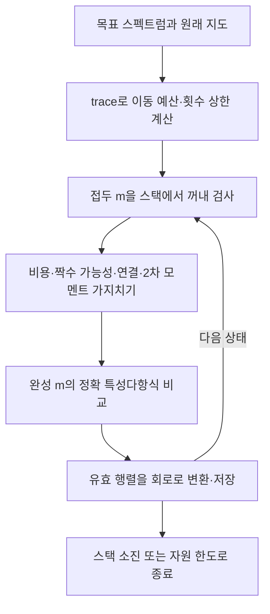

# ⑦ 선택한 스펙트럼의 모든 정수 경로 찾기

## 현재 통합 실행 설정
`solve_spectral_map`은 `solve_inverse(..., max_count=2, ap_restarts=0)`을 호출한다. 주 실행은 정확 정수 역탐색이다. 파일에 교대 투사 기능이 함께 있지만 통합 실행에서는 꺼져 있다.
## 주요 행렬과 벡터
입력은 원래 지도와 목표 계수 c다. `travel_budget=trace_target−Σa_i`이며 `Σw_e m_e`와 같아야 한다. m을 부분적으로 정한 접두 상태를 스택으로 탐색한다.
`R=H[I+B diag(gm)Bᵀ]`의 대각 누적값과 비대각 제곱 기여를 유지한다. `trace(R²)=Σ_i R_ii²+2Σ_e a_u a_v(g_e m_e)²`로 2차 모멘트의 상·하한을 검사한다.
## 가지치기
- 남은 도로의 최대 비용과 비용 gcd로 목표 trace 달성 가능성 검사.
- 홀수 차수를 앞으로 보정할 도로가 남아 있는지 검사.
- 이미 사용한 도로와 앞으로 사용 가능한 도로를 합쳐도 가게 연결이 불가능하면 제거.
- 목표 2차 모멘트가 가능한 범위를 벗어나면 제거.
- 완성된 m은 경로 조건·비용·정확 charpoly를 모두 검사한다. 여기서는 후보 R의 charpoly 계산이 실제로 존재한다. ⑤의 무후보 고유분해 설명을 ⑦까지 확대하지 않는다.
## 종료와 선택 기능
스택을 다 처리하면 범위 안의 모든 해를 찾았다. 상태/해 개수 한도에 걸리면 partial이다. 기본 상태 한도 200000, 해 한도 10000이다.
단독 `solve_inverse`는 max_count를 생략하면 trace 기반의 더 넓은 횟수를 다룰 수 있고 AP 기본값도 다르다. 이는 통합 실행 설정과 구분한다. `_projection_proposals`는 수치 교대 투사 후보 제안일 뿐 완전성을 인증하지 않는다.

## 복사 코드와 함수 목록

[원본 그대로의 inverse_spectrum.py](inverse_spectrum.py)

`_projection_proposals`, `solve_inverse`

표시된 함수 중 예제 생성·교대 투사·수치 행렬은 위 설명의 호출 범위에 따라 보조 기능일 수 있다.
