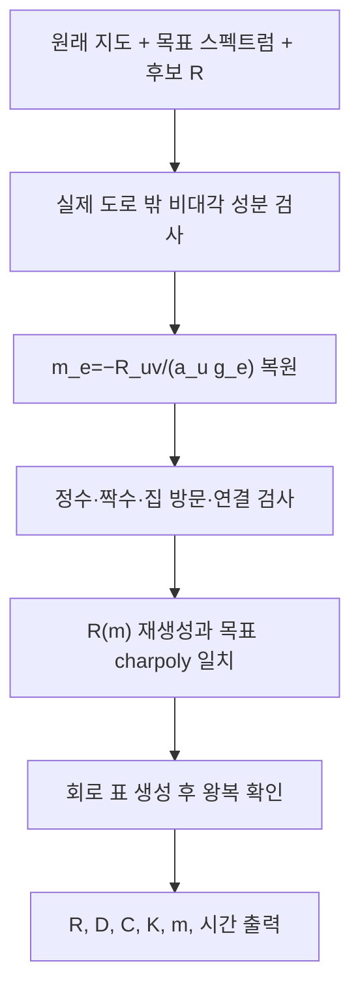

# 정확 행렬에서 LC 회로와 지도 경로 복원

## 여섯 조건의 마지막 인증
지도에 없는 도로를 허용하지 않고, 복원한 m이 허용 정수인지 검사한다. 재생성한 전체 R이 같아야 하므로 대각값과 양방향 비율도 동시에 검증된다. 경로 유효성과 목표 스펙트럼까지 맞으면 LC 표를 만들고 다시 복호화한다.
## 주요 변환 행렬
`S=diag(sqrt(a_i))`, `Kbar=H^(-1)R`, `D=S^(-1) R S`.
`C_phys=C★H^(-1)`, `K_phys=Kbar/L★`.
R과 D는 유사하므로 같은 μ를 갖는다. C_phys와 K_phys 자체의 고윳값을 각각 경로 시간으로 읽으면 안 된다.
## 함수별 범위
- `family_matrix`는 정확 R을 만든다. 비음 정수 횟수만 검사하고 경로 연결 등은 별도 검증한다.
- `recover_matrix`는 유리수 R 또는 normalized_K를 받아 모든 조건과 회로 왕복을 검사한다.
- `recover_symmetric_matrix`는 float 없는 정확 SymPy 대칭 D를 S D S^(-1)로 바꿔 동일 검사를 한다.
- `parse_matrix`, `string_rows`는 정확 수 입력과 JSON 표현 보조다.
## 일대일 대응의 범위
원래 지도·라벨·배정 규칙이 고정되면 m↔R(m)↔정규 LC 표가 일대일이다. 고윳값만으로는 여러 R이 가능하다. R만으로 사용하지 않은 도로의 원래 비용까지 복원할 수 없으므로 원래 지도를 함께 사용한다.

## 복사 코드와 함수 목록

[원본 그대로의 matrix_recovery.py](matrix_recovery.py)

`family_matrix`, `parse_matrix`, `string_rows`, `recover_matrix`, `recover_symmetric_matrix`

표시된 함수 중 예제 생성·교대 투사·수치 행렬은 위 설명의 호출 범위에 따라 보조 기능일 수 있다.
