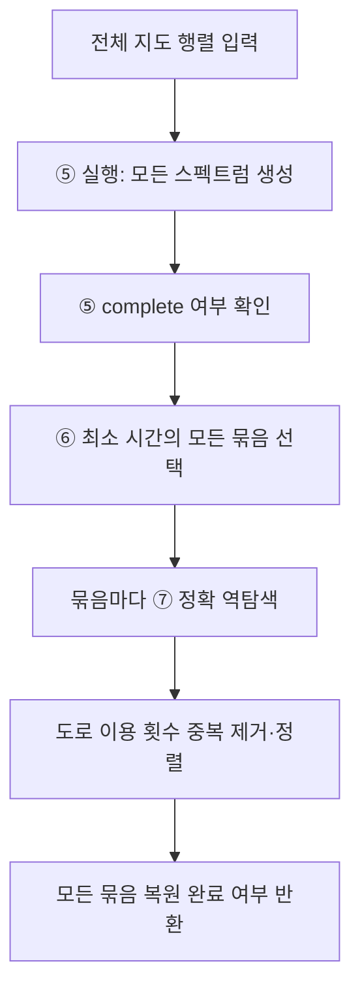

# ⑤·⑥·⑦의 연결과 최종 완료 판정

## 입력과 출력
`solve_spectral_map(whole_map, ...)`이 통합 진입점이다. 결과는 `lc-spectral-pipeline-v1`이며 generation, inverse_results, optimal_route_counts를 포함한다.
## 요소별 분기
- ⑤가 미완료이면 ⑦을 실행하지 않고 generation_incomplete로 끝낸다.
- ⑤가 완결되면 관측 최소가 전체 최소로 인증된다.
- 같은 최소 시간에 여러 스펙트럼이 있으면 각각을 모두 ⑦에 넣는다.
- 모든 역탐색이 완료되어야 complete와 all_optimal_routes_recovered가 true다.
- ⑤는 완료되고 ⑦이 부분 종료하면 optimal_time_certified는 true일 수 있지만 모든 경로 복원 완료는 false다.
## 사용하는 행렬
새 행렬 정의를 추가하지 않는다. 전체 지도 R_map, 스펙트럼 계수 c, ⑦의 정확 R(m), 복원된 Kbar·D·C_phys·K_phys와 회로 표를 이어준다.
## 출력 의미
최종 경로는 도로별 이용 횟수 벡터다. 실제 방문 순서 목록을 만드는 것은 현재 출력 목표에 포함하지 않았다. 원래 지도에서는 이 벡터로 어떤 도로를 몇 번 쓰는지 제시할 수 있다.

## 복사 코드와 함수 목록

[원본 그대로의 spectral_pipeline.py](spectral_pipeline.py)

`solve_spectral_map`

표시된 함수 중 예제 생성·교대 투사·수치 행렬은 위 설명의 호출 범위에 따라 보조 기능일 수 있다.
