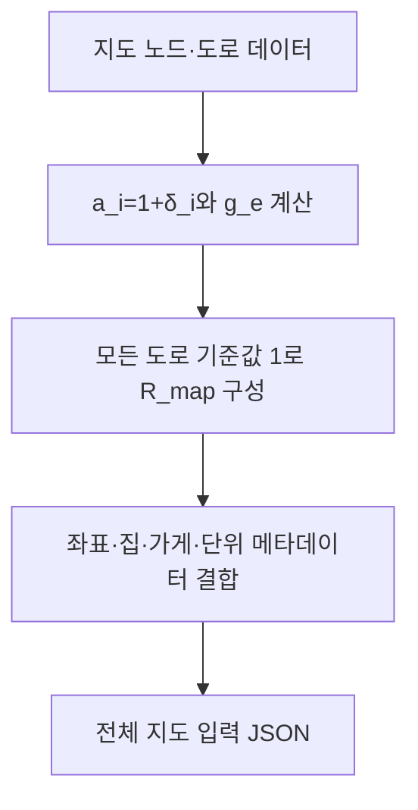

# 지도행렬의 구성·정의·생성 조건

## 저장 형식
운영 코드의 지도행렬은 `lc-whole-map-v1`의 `R_map`이다. n×n 유리수 행렬과 nodes 메타데이터, depot, units, name을 함께 저장한다. 원래 지도 JSON `lc-grid-v1`과 구분한다.
## 기호
| 기호 | 크기/의미 |
|---|---|
| n, p | 노드 수, 실제 무방향 도로 수 |
| w_e | 도로 e의 양의 정수 이동 시간(틱) |
| δ_i | 집 i의 비음 정수 일회 지연(틱), 비집은 0 |
| a_i, H | 1+δ_i, n×n 대각행렬 diag(a_i) |
| B | n×p 접속행렬. 도로 u<v의 열은 u에서 +1, v에서 −1 |
| g_e | w_e/(a_u+a_v)>0 |
| R_map | H[I+B diag(g)Bᵀ] |
## 원소별 규칙
`R_map[i,i]=a_i(1+Σ_(e incident i)g_e)`.
도로 e=(u,v)에 대해 `R_map[u,v]=−a_u g_e`, `R_map[v,u]=−a_v g_e`. 도로가 없으면 두 값 모두 0이다. 일반적으로 R_map은 대칭이 아니지만 아래 LC의 대칭 D와 유사하다.
## 생성 조건
상하좌우 한 칸 도로, 중복 없는 u<v, 양의 정수 w, 정수 좌표, 비음 정수 지연, 가게 1번, 정규 정렬, 모든 필수 집의 도달성을 검사한다. 단위 t★, L★, C★는 양의 정확 유리수다. 행렬 JSON에서는 정수/분수 문자열을 써서 오차를 피한다.
## 복원
행 합 a_i에서 δ_i를 구한다. `g_uv=−R_uv/a_u=−R_vu/a_v`이고 `w=g_uv(a_u+a_v)`로 복원한다. 좌표와 집 여부는 메타데이터에서 읽는다.
## 주의
이 행렬의 기준 횟수 1은 모든 도로가 존재함을 나타낸다. 그 자체를 후보 경로로 취급하지 않는다. 또한 지연 0인 집을 알아야 하므로 행렬 숫자만으로는 전체 입력이 완성되지 않는다.
## 실제 수치 예
04_실행예제/행렬설명용_3노드/지도.json과 지도행렬.json을 참고한다. 가게–집–집의 직선이며 w=(2,3), δ=(0,1,2)이다.
`R_map = [[5/3, −2/3, 0], [−4/3, 68/15, −6/5], [0, −9/5, 24/5]]`.
행 합은 (1,2,3)이며 지연 (0,1,2)를 복원한다.
