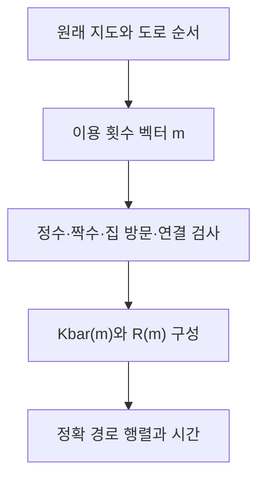

# 경로행렬과 이용 횟수의 구성·정의·생성 조건

## 운영 코드에서의 의미
경로의 기본 저장값은 `counts` 또는 `optimal_route_counts`의 횟수 벡터 m이다. 별도의 새 인접행렬 형식을 도입한 것이 아니다. 각 m을 표현하는 정확 행렬은 `R(m)`이며 복원 출력 키는 `rational_matrix_similar_to_D`다.
## 정의
`m=(m_0,...,m_(p−1))`, `M=diag(m)` (p×p의 설명용 대각행렬).
`Kbar(m)=I+B diag(g_e m_e)Bᵀ`, `R(m)=H Kbar(m)`.
코드는 M과 B를 매번 밀집 행렬로 만들기보다 도로 목록으로 성분을 더한다. `R_ii=a_i(1+Σg_e m_e)`이고 실제 도로의 `R_uv=−a_u g_e m_e`다.
## 생성 조건
- 통합 최적 탐색의 m은 0·1·2의 정수다.
- 모든 꼭짓점에서 인접 횟수 합이 짝수여야 한다.
- 모든 필수 집과 모든 사용 도로가 가게에 연결되어야 한다.
- 같은 도로를 몇 번 썼는지는 구분하지만, 그 순서가 다른 경우는 별도 후보로 세지 않는다.
- 모든 w>0이므로 최적 경로에서 m_e≥3이면 2를 빼서 지지집합·짝수성을 유지하고 비용을 줄일 수 있다. 따라서 모든 최적해는 0·1·2 범위에 있다.
## 시간과 스펙트럼
`time_ticks=Σw_e m_e+Σδ_i=trace(R)−n=Σμ_j−n`.
특성다항식 전체가 같으면 같은 시간이다. trace만 같으면 시간이 같을 뿐 전체 스펙트럼까지 같지는 않다.
## 복원과 일대일 대응
원래 지도가 고정되면 `m_e=−R_uv/(a_u g_e)`로 유일하게 복원된다. 지도에 없는 성분, 정수가 아닌 횟수, 다른 대각 성분을 가진 행렬은 거부한다.
하지만 R(m)만으로 m=0인 도로의 원래 존재·비용을 알아낼 수는 없다. **원래 지도 + R(m)**으로 복원한다. 고윳값만으로는 여러 경로행렬이 가능하므로 ⑦이 그 전체를 찾는다.
## 실제 수치 예
설명용 직선의 유효 m=(2,2)에 대해
`R(m) = [[7/3, −4/3, 0], [−8/3, 106/15, −12/5], [0, −18/5, 33/5]]`.
`trace(R)=16`, n=3이므로 시간은 13틱이다. 직접 합도 2×2+3×2+1+2=13이다. 정확 특성다항식과 회로 JSON은 같은 설명용 예제 폴더에 저장한다.
