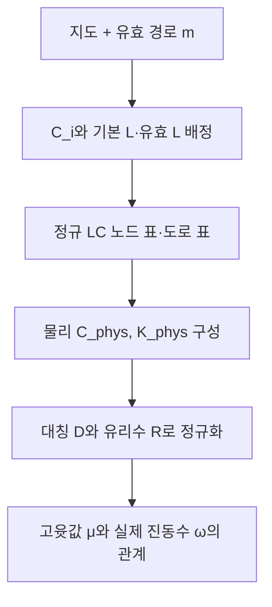

# LC 회로의 소자 표·물리 행렬·스펙트럼 행렬

## 서로 다른 두 종류의 표현
**회로 구조를 저장하는 표**와 **운동 방정식을 계산하는 행렬**을 구분한다. 부품 종류 코드 1·2를 적은 표 자체의 고윳값을 계산하지 않는다. 표를 해석하여 C_phys, K_phys, D, R을 구성한다.
## 1. 정규 소자 표
`lc-circuit-v1`의 nodes는 n×8, branches는 p×7이다.
| 표 | 열 순서 |
|---|---|
| nodes | id, x, y, house, C_type, C_farad, ground_L_type, ground_L_henry |
| branches | id, u, v, direction, L_type, base_L_henry, count |
종류 코드 L=1, C=2. 접지=0, 가게=1. 방향은 오른쪽 1, y 증가 2, 왼쪽 3, y 감소 4다. y 증가를 도면에서 위로 그릴지 아래로 그릴지는 표시 방식이며 코드의 좌표 차 규칙은 고정이다.
## 2. 소자 배정
`C_i=C★/(1+δ_i)=C★/a_i`이고 모든 노드에 `L★`의 접지 인덕터를 둔다.
도로 기본 인덕턴스 `ell_e=L★(a_u+a_v)/w_e=L★/g_e`.
m_e>0이면 `L_eff=ell_e/m_e`; 같은 기본 인덕터 m_e개를 병렬로 둔 해석과 같다. m_e=0이면 개방이다. base_L과 원래 도로 행은 count=0일 때도 보존한다.
L이 이동 시간에만 단순 비례하는 것은 아니다. 양 끝점의 배달 지연까지 포함한 g 정의로 trace의 시간 합산을 맞춘다.
## 3. 물리 행렬
`C_phys=C★ H^(-1)` (n×n 대각, 단위 F).
`K_phys=(1/L★)[I+B diag(gm)Bᵀ]=Kbar/L★` (n×n 대칭, 단위 1/H).
자유 진동의 노드 전압 v는 `C_phys v¨ + K_phys v=0`을 만족한다. 실제 고유모드는 `K_phys φ=ω² C_phys φ`라는 일반화 고윳값 문제다. 공진 주파수 f=ω/(2π)이다.
## 4. 정규화 계산 행렬
`S=H^(1/2)`, `D=S Kbar S`는 대칭 양의 정부호다.
`R=H Kbar=S D S^(-1)`는 정확 유리수 행렬이고 D와 같은 μ를 갖는다.
`μ=L★ C★ ω²`이며 μ는 무차원이다. 시간은 t★(Σμ−n)로 읽는다. R은 저항을 뜻하는 이름이 아니다. 현재 모델은 LC이며 손실 저항은 포함하지 않는다.
## 5. 생성·검증 조건
L★,C★>0, 모든 a_i≥1, 모든 g_e>0. 실제 도로만 사용하고 m은 허용 정수여야 한다. 모든 노드의 접지 소자를 유지하므로 Kbar와 D는 양의 정부호이고 μ>0이다. 정규 소자 표를 다시 해석했을 때 지도와 m이 정확히 돌아와야 한다.
## 6. 일대일 관계와 변환
고정된 지도·라벨·L★·C★에서 m↔정규 소자 표↔R(m)이 일대일이다. 이는 임의의 모든 물리 회로가 유일하다는 주장이 아니라 정해 둔 정규 표현 안의 유일성이다.
표에서 지도 정보를 복원할 때 `δ=C★/C_i−1`, `w=L★(a_u+a_v)/ell_e`를 쓴다. 표의 열을 삭제하는 것만으로 복원하는 방식은 아니다.
정확 출력은 normalized_K, physical_C, physical_K_inverse_inductance, D_exact, rational_matrix_similar_to_D로 저장된다. 근삿값 D와 정확 D_exact를 구분한다.
